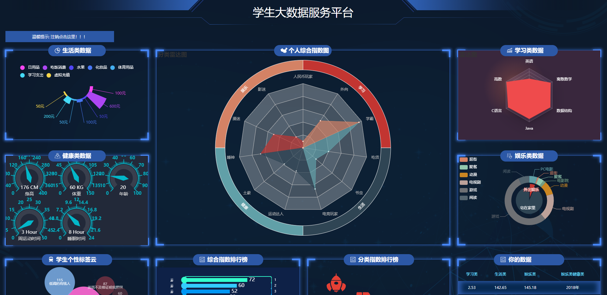

## 学生个人数据可视化平台
### 项目背景
项目管理课程需要组队完成一个完整的项目,但队员都在划水，只能自己慢慢搬砖了。
### 项目构建
项目前端采用jQuery+Echars+EasyUI搭建 

页面逻辑有JQuery写，数据图表通过Echars实现 

项目后端部分由基于node.jd的think.js搭建。数据库采用的MySQL
### 项目逻辑
学生登录前需要注册，注册时就可以统计个人信息。 

然后跳转到数据展示页面，展示所有个人的信息 

并通过智能计算给出一个人在各个领域评分

### 项目展示
链接：http://studentsview.jianjiacheng.com

